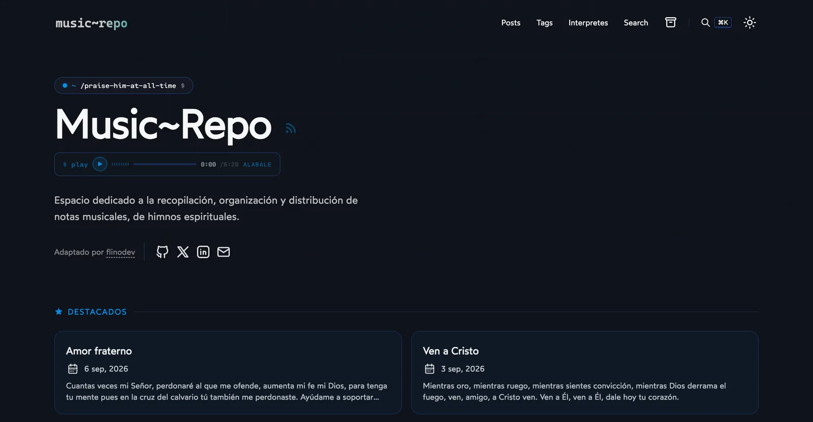

# Music~Repo

Repositorio de **notas musicales, letras y acordes de himnos espirituales**. Cada entrada reúne la letra completa, el tono y compás, las notas por instrumento (mandolina, violín, trompeta, flauta, saxofón), audios de referencia y los acordes de guitarra alineados sobre la letra.

Construido sobre una versión fuertemente personalizada del tema [AstroPaper](https://github.com/satnaing/astro-paper): estética propia, buscador global, reproductor de audio, sección de intérpretes y componentes musicales a medida.

**🌐 Sitio:** [www.music-repo.com](https://www.music-repo.com)



> **Nota:** este es un proyecto personal. Si alguien quiere reutilizarlo, puede borrar el contenido de `src/data/blog/` y ajustar `src/config.ts` a su gusto.

---

## Tabla de contenidos

1. [Características](#-características)
2. [Stack](#-stack)
3. [Estructura del proyecto](#-estructura-del-proyecto)
4. [Instalación y desarrollo local](#-instalación-y-desarrollo-local)
5. [Comandos](#-comandos)
6. [Crear contenido](#-crear-contenido)
   - [Frontmatter](#frontmatter)
   - [Anatomía de un himno](#anatomía-de-un-himno)
7. [Componentes para MDX](#️-componentes-para-mdx)
   - [ChordLine](#chordline--acordes-sobre-la-letra)
   - [Chord y ChordButton](#chord-y-chordbutton--diagramas-de-acordes)
   - [IntroAudio](#introaudio--audio-de-referencia)
   - [YouTubeEmbed](#youtubeembed)
   - [GalleryEmbed](#galleryembed)
8. [Configuración](#️-configuración)
9. [SEO](#-seo)
10. [Galerías](#️-galerías)
11. [Issues de upstream resueltos](#-issues-de-upstream-resueltos)
12. [Licencia](#-licencia)

---

## ✨ Características

### Contenido musical

- **88 himnos** en `src/data/blog/` (Markdown y MDX), con letra, tono, compás, intérprete y referencias
- **Acordes en formato ChordPro** renderizados encima de la sílaba exacta con `<ChordLine>`; cada acorde abre su diagrama en un `<dialog>`
- **Diagramas de acordes** (`<Chord>` y `<ChordButton>`) con más de 40 acordes mapeados: mayores, menores, sostenidos y séptimas
- **Audios por instrumento** embebidos con `<IntroAudio>` (mandolina 1ª/2ª voz, violín, trompeta, flauta, saxofón) desde `public/audio/`
- **Notas musicales en cifra** por instrumento y voz, con repeticiones (`//…//`) y ligados (`<sup>T</sup>`)
- **Referencias en video** con `<YouTubeEmbed>`, incluyendo salto al minuto exacto

### Navegación y descubrimiento

| Ruta                    | Contenido                                                              |
| :---------------------- | :--------------------------------------------------------------------- |
| `/`                     | Hero con prompt de terminal, reproductor intro, destacados y recientes |
| `/posts`                | Listado paginado de todos los himnos                                   |
| `/posts/<slug>`         | Detalle del himno: letra, notas, acordes, intérprete, compartir        |
| `/interpretes`          | Grupos, duetos y solistas con contador de himnos                       |
| `/interpretes/<slug>`   | Himnos de un intérprete (paginado)                                     |
| `/tags` · `/tags/<tag>` | Temas: Evangelismo, Esperanza, Testimonio, Alabanza, IECE…             |
| `/archives`             | Línea de tiempo vertical por fecha                                     |
| `/search`               | Buscador Pagefind a página completa                                    |
| `/galleries`            | Álbumes de imágenes (opcional, desactivado por defecto)                |

- **Buscador global (⌘K / Ctrl+K)**: modal con navegación por teclado sobre el índice estático de **Pagefind**
- **Intérpretes** como eje independiente de los tags: los tags describen el tema del himno, `composer` dice quién lo interpreta
- **Breadcrumbs** en todas las páginas, con botón de volver en el detalle del himno

### Diseño

- Hero con prompt animado configurable desde `heroTerminalPrompt` (por defecto `~/praise-him-at-all-time $`)
- Glassmorphism en navbar, tarjetas y modales; modo claro/oscuro
- Efectos de fondo opcionales (`cursorGlow`, `grain`) desde `backdropEffects`
- Reproductor de audio con estética de terminal: versión completa en el home y versión compacta en la navbar al navegar

### Tipografías

| Uso              | Fuente                  |
| :--------------- | :---------------------- |
| Cuerpo           | `Wotfard` (local)       |
| Código / mono    | `Cascadia Code` (local) |
| Mono alternativa | `Cartograph CF` (local) |
| Cursivas / H3    | `Sriracha` (local)      |

Todas se cargan con la API de fuentes de Astro (`fontProviders.local()`); solo se precarga la del cuerpo para no competir por ancho de banda.

---

## 🧱 Stack

- [Astro 6](https://astro.build) con [MDX](https://docs.astro.build/en/guides/integrations-guide/mdx/)
- [Tailwind CSS 4](https://tailwindcss.com) (vía `@tailwindcss/vite`)
- [Pagefind](https://pagefind.app) (`astro-pagefind`) para la búsqueda estática
- [Satori](https://github.com/vercel/satori) + `@resvg/resvg-js` para las imágenes OG dinámicas
- [`@astrojs/vercel`](https://docs.astro.build/en/guides/deploy/vercel/) como adaptador, con Vercel Web Analytics
- `@astrojs/sitemap`, `@astrojs/rss`, `dayjs`, `sharp`, `shiki`

---

## 🚀 Estructura del proyecto

```
/
├── public/
│   ├── audio/             # Audios de referencia por himno e instrumento
│   ├── images/chords/     # Diagramas de acordes (doMa.png, reme.png, …)
│   └── pagefind/          # Índice de búsqueda (generado en el build)
├── src/
│   ├── assets/            # Fuentes locales, iconos SVG y logo
│   ├── components/        # Chord, ChordLine, ChordButton, IntroAudio, YouTubeEmbed…
│   ├── data/
│   │   ├── blog/          # Himnos .md / .mdx
│   │   └── galleries/     # Galerías (una carpeta por álbum)
│   ├── layouts/           # Layout, Main, PostDetails, AboutLayout
│   ├── pages/             # Rutas Astro (posts, interpretes, tags, archives…)
│   ├── styles/            # global.css, typography.css
│   ├── utils/             # Intérpretes, letras para JSON-LD, sitemap, OG…
│   ├── config.ts          # Configuración del sitio
│   └── content.config.ts  # Colecciones y esquema del frontmatter
└── astro.config.ts
```

---

## 👨🏻‍💻 Instalación y desarrollo local

**Requisitos:** Node.js 20+ y pnpm.

```bash
# 1. Instalar dependencias
pnpm install

# 2. Servidor de desarrollo
pnpm run dev
# → http://localhost:4321
```

El índice de Pagefind **solo se genera en el build**. Para probar la búsqueda en local:

```bash
pnpm run build && pnpm run preview
```

### Docker

```bash
docker build -t music-repo .
docker run -p 4321:80 music-repo
```

---

## 🧞 Comandos

| Comando                 | Acción                                              |
| :---------------------- | :-------------------------------------------------- |
| `pnpm install`          | Instalar dependencias                               |
| `pnpm run dev`          | Servidor local en `localhost:4321`                  |
| `pnpm run build`        | Build de producción (`astro check` + `astro build`) |
| `pnpm run preview`      | Previsualizar el build de producción                |
| `pnpm run sync`         | Regenerar los tipos de las content collections      |
| `pnpm run format`       | Formatear con Prettier                              |
| `pnpm run format:check` | Verificar formato sin escribir                      |
| `pnpm run lint`         | Lint con ESLint                                     |

---

## 📝 Crear contenido

Crea un archivo `.md` o `.mdx` en `src/data/blog/`. El nombre del archivo es el slug: `mi-himno.mdx` → `/posts/mi-himno`.

### Frontmatter

```yaml
---
title: "Un reconocimiento" # requerido
description: "Haciendo un reconocimiento a tu grandeza…" # requerido, preview de tarjeta y RSS
pubDatetime: 2026-08-10T22:59:00Z # requerido, ISO 8601 con zona horaria
composer: "Grupo Elim" # intérprete: genera /interpretes/<slug> y el JSON-LD
tags: # temas del himno (por defecto ["others"])
  - Alabanza
  - Adoración
seoTitle: "Un reconocimiento — Letra | Grupo Elim" # opcional, sobrescribe el <title>
seoDescription: 'Letra completa de "Un reconocimiento"…' # opcional, solo la meta description
keywords: # términos de búsqueda
  - "un reconocimiento letra"
featured: true # destacar en el home
draft: false # oculto en producción
modDatetime: # opcional, alimenta el lastmod del sitemap
timezone: "America/Guatemala" # opcional, sobrescribe SITE.timezone
author: "flinodev" # opcional, por defecto SITE.author
ogImage: # opcional, local o URL absoluta
canonicalURL: # opcional
hideEditPost: false # opcional
---
```

Si no defines `seoTitle`, el `<title>` se arma como `"<title> — Letra | Music~Repo"`, que es la intención de búsqueda real de estas páginas.

### Anatomía de un himno

La estructura que siguen los posts del repo:

```markdown
## Tabla de contenidos <!-- se autogenera con remark-toc + remark-collapse -->

## Detalles

- Tono: Si m
- Compás: 6/8
- Grupo: Grupo Elim

## Notas musicales <!-- cifra por instrumento y voz, con <IntroAudio> -->

## Letra <!-- se extrae para MusicComposition.lyrics del JSON-LD -->

## Acordes guitarra <!-- líneas con <ChordLine> -->

## Referencias <!-- <YouTubeEmbed> -->
```

> La sección `## Letra` alimenta el `lyrics` del JSON-LD, así que conviene mantener ese encabezado exacto.

**Bloques de código anotados** (transformers de Shiki):

```
// [!code highlight]      → resaltar la línea
// [!code ++]             → línea añadida (diff)
// [!code --]             → línea eliminada (diff)
// fileName: file.ts      → mostrar el nombre del archivo sobre el bloque
```

---

## 🎸 Componentes para MDX

Salvo `GalleryEmbed` (disponible sin importar), los componentes se importan al inicio del `.mdx`:

```mdx
import ChordLine from "@/components/ChordLine.astro";
import IntroAudio from "@/components/IntroAudio.astro";
import YouTubeEmbed from "@/components/YouTubeEmbed.astro";
```

### `ChordLine` — acordes sobre la letra

Formato ChordPro: el acorde entre corchetes se posiciona justo encima de la sílaba donde entra.

```mdx
<ChordLine lyrics="[mime]Donde dos o [reMa]tres se encu[doMa]entren" />
<ChordLine lyrics="En el nombre de [solMa]Dios" />
```

Cada acorde es clicable y abre su diagrama en un modal.

### `Chord` y `ChordButton` — diagramas de acordes

```mdx
<Chord name="doMa" />        <!-- diagrama con título, para tutoriales -->
<ChordButton name="mime" />  <!-- botón compacto que abre el diagrama -->
```

**Convención de nombres** (la imagen vive en `public/images/chords/<name>.png`):

| Tipo              | Patrón        | Ejemplos                |
| :---------------- | :------------ | :---------------------- |
| Mayor             | `<nota>Ma`    | `doMa`, `solMa`, `laMa` |
| menor             | `<nota>me`    | `dome`, `mime`, `lame`  |
| Sostenido mayor   | `<nota>sosMa` | `dososMa`, `fasosMa`    |
| Sostenido menor   | `<nota>sosme` | `dososme`, `fasosme`    |
| Séptima           | `<nota>7`     | `do7`, `sol7`, `la7`    |
| Sostenido séptima | `<nota>sos7`  | `dosos7`, `fasos7`      |

Un nombre no mapeado lanza un error en el build, así que las erratas se detectan antes de publicar.

### `IntroAudio` — audio de referencia

```mdx
<IntroAudio
  src="/audio/un_reconocimiento_mandolina_1.m4a"
  label="MANDOLINA_1.M4A"
  duration={40}
/>
```

Props: `src` (requerido), `label`, `duration` (segundos), `isStream`, `class`. Es el mismo reproductor que usa el hero del home.

### `YouTubeEmbed`

```mdx
<YouTubeEmbed videoId="nPURUvrpEpo" title="Sean Bienvenidos" startTime={1840} />
```

`startTime` en segundos; el iframe va con `modestbranding`, `rel=0` y `playsinline`.

### `GalleryEmbed`

Disponible en cualquier `.mdx` **sin importarlo**:

```mdx
<GalleryEmbed slug="fotografia-urbana" />
```

Props opcionales: `limit` (`0` = todas), `cols` (`2 | 3 | 4`), `showLink`. Detalles en [GALLERIES.md](GALLERIES.md#galleryembed--gallery-inside-mdx-posts).

---

## ⚙️ Configuración

Todo vive en `src/config.ts` (constante `SITE`). Lo más relevante:

| Opción                        | Descripción                                                                |
| :---------------------------- | :------------------------------------------------------------------------- |
| `website`, `title`, `desc`    | Identidad del sitio y base de las URLs canónicas                           |
| `postPerIndex`, `postPerPage` | Himnos en el home y por página en los listados                             |
| `showInterpretes`             | Muestra/oculta la sección de intérpretes en la navegación                  |
| `minPostsToIndexInterprete`   | Umbral de himnos por debajo del cual una página de intérprete va `noindex` |
| `showArchives`, `showAbout`   | Enlaces de archivo y "acerca de" en el nav                                 |
| `showGalleries`               | Habilita `/galleries` (desactivado por defecto)                            |
| `showGalleriesInIndex`        | Mezcla galerías en los listados y el RSS (requiere `showGalleries`)        |
| `showBackButton`              | Botón de volver en el detalle del himno                                    |
| `heroTerminalPrompt`          | Prompt animado del hero (`prefix`, `path`, `suffix`)                       |
| `backdropEffects`             | `cursorGlow` y `grain` del fondo global                                    |
| `introAudio`                  | Reproductor intro: `enabled`, `src`, `label`, `duration`, `isStream`       |
| `editPost`                    | Enlace "editar este post" hacia GitHub                                     |
| `dynamicOgImage`              | Imagen OG por post generada con Satori                                     |
| `lang`, `dir`, `timezone`     | Idioma (`es`), dirección y zona horaria por defecto                        |
| `scheduledPostMargin`         | Margen para posts programados (15 min)                                     |

Los enlaces sociales y los botones de compartir están en `src/constants.ts`.

Variable de entorno opcional: `PUBLIC_GOOGLE_SITE_VERIFICATION`.

---

## 🔎 SEO

El sitio está afinado para la intención de búsqueda "`<himno>` letra":

- **URLs canónicas consistentes**: `trailingSlash: "never"`, host normalizado con `www`, y el mismo formato en canonical, sitemap, RSS y enlaces internos
- **JSON-LD**: `BlogPosting` con `about` de tipo [`MusicComposition`](https://schema.org/MusicComposition), incluyendo `composer` (`MusicGroup`) y la letra extraída de la sección `## Letra` (`src/utils/extractLyrics.ts`)
- **`lastmod` en el sitemap** a partir de `modDatetime`/`pubDatetime`, leído directamente del frontmatter (`src/utils/sitemapLastmod.ts`)
- **Páginas de intérprete con pocos himnos** (menos de `minPostsToIndexInterprete`) se generan para navegar, pero van `noindex` y se excluyen del sitemap (`src/utils/thinComposerPaths.ts`) para no anunciar contenido pobre
- **`seoTitle` / `seoDescription` por post**, separados de la `description` que se usa en las tarjetas y el RSS
- **Imágenes OG dinámicas** por post con Satori, más `robots.txt` y RSS generados en el build

---

## 🖼️ Galerías

El soporte de álbumes de imágenes (`/galleries`, lightbox nativo con `<dialog>`, optimización en build, `<GalleryEmbed>`) está incluido pero **desactivado** con `showGalleries: false`. La documentación completa —frontmatter, portadas, orden de imágenes— está en [GALLERIES.md](GALLERIES.md).

---

## 🐛 Issues de upstream resueltos

Bugs y peticiones del repositorio oficial de [AstroPaper](https://github.com/satnaing/astro-paper) implementados en esta versión:

| Issue                                                      | Descripción                                                                                                                                                                                                      | Archivos                                     | Créditos                                                                                                                                             |
| :--------------------------------------------------------- | :--------------------------------------------------------------------------------------------------------------------------------------------------------------------------------------------------------------- | :------------------------------------------- | :--------------------------------------------------------------------------------------------------------------------------------------------------- |
| [#614](https://github.com/satnaing/astro-paper/issues/614) | **Back to Top desplaza el botón de paginación** cuando `ShareLinks` está vacío                                                                                                                                   | `BackToTopButton.astro`                      | —                                                                                                                                                    |
| [#574](https://github.com/satnaing/astro-paper/issues/574) | **Las tablas de Markdown desbordan el layout en móvil** — resuelto con `w-full table-auto` y `word-wrap` en las celdas                                                                                           | `typography.css`                             | [@GladerJ](https://github.com/GladerJ) — [solución](https://github.com/satnaing/astro-paper/issues/574#issuecomment-3427381261)                      |
| [#569](https://github.com/satnaing/astro-paper/issues/569) | **Back to Top inconsistente en escritorio** — diseño circular unificado con anillo de progreso y posición `fixed`                                                                                                | `BackToTopButton.astro`, `PostDetails.astro` | —                                                                                                                                                    |
| [#566](https://github.com/satnaing/astro-paper/issues/566) | **Los enlaces de compartir no abren en pestaña nueva** — añadidos `target="_blank"` y `rel="noopener noreferrer"`                                                                                                | `ShareLinks.astro`                           | [PR #611](https://github.com/satnaing/astro-paper/pull/611) por [@zerone0x](https://github.com/zerone0x)                                             |
| [#131](https://github.com/satnaing/astro-paper/issues/131) | **Sin soporte MDX** — integración `@astrojs/mdx` con `extendMarkdownConfig: true`                                                                                                                                | `astro.config.ts`, `content.config.ts`       | —                                                                                                                                                    |
| [#495](https://github.com/satnaing/astro-paper/issues/495) | **Filtrado de posts inconsistente por zona horaria** — resuelto con `dayjs` + plugins `utc`/`timezone`; además se corrigió un bug de la solución de referencia que usaba `.millisecond()` en vez de `.valueOf()` | `postFilter.ts`                              | [@kj-9](https://github.com/kj-9) — [fix de referencia](https://github.com/satnaing/astro-paper/compare/main...kj-9:astro-paper:fix-post-filter-date) |
| [#553](https://github.com/satnaing/astro-paper/issues/553) | **Sin sección de galerías** — sección `/galleries` completa con lightbox, `GalleryEmbed`, optimización de imágenes y flag `showGalleries`                                                                        | varios — ver GALLERIES.md                    | —                                                                                                                                                    |

---

## 📜 Licencia

Basado en [AstroPaper](https://github.com/satnaing/astro-paper) de [Sat Naing](https://satnaing.dev), bajo licencia MIT.
Personalizaciones © [flinodev](https://github.com/flinodev).
